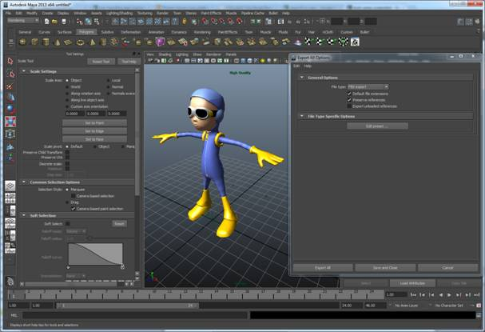

At the heart of any game is a visual scene. Using the `gameplay::Scene` class, you can create and retain a rich 3-D scene for organizing visual, audio, animation and physics components in your game.

The `gameplay::Scene` class is based on a hierarchical data structure that is often referred to as a scene graph. Using the `gameplay::Scene` and `gameplay::Node` classes, you can build up a game level by attaching various game components to the nodes in the scene. The node will maintain the transformation for any attachments. As a basic example, a scene might have two nodes. The first node could have a `gameplay::Camera` attached to it and the second node could have a `gameplay::Model` attached to it. The `gameplay::Scene` will have the camera set as the active camera. You could then transform either/both of the nodes to change the player's perspective on what they will see in the game.

There are a variety of components you can attach to the `gameplay::Node` class:


<table>
<tr>
  <th align=left>Component</th>
  <th align=left>Description</th>
</tr>

<tr>
  <td>gameplay::Model</td>
  <td>Used to represent the mesh/geometry in the scene.</td>
</tr>

<tr>
  <td>gameplay::Camera</td>
  <td>Used to represent a view/perspective into the scene.</td>
</tr>

<tr>
  <td>gameplay::Light</td>
  <td>Used to hold lighting information that can affect how a Model is rendered.</td>
</tr>

<tr>
  <td>gameplay::PhysicsCollisionObject</td>
  <td>Used to define the basic physics dynamics that will be simulated.</td>
</tr>

<tr>
  <td>gameplay::ParticleEmitter</td>
  <td>Used to represent smoke, steam, fire and other atmospheric effects.</td>
</tr>

<tr>
  <td>gameplay::Terrain</td>
  <td>Used to represent a height map based terrain.</td>
</tr>

<tr>
  <td>gameplay::AudioSource</td>
  <td>Used to represent a source where audio is being played from.</td>
</tr>

<tr>
  <td>gameplay::Form</td>
  <td>Used to represent a user interface that can be in a scene.</td>
</tr>

</table>

A typical flow will have you loading/building a large scene representing all the components needed in the game level. This is done once during `Game::initialize()`. For every call to the `Game::update()` method, the code will update changes to the nodes and attached components based on events such as user input . Then the application will traverse the scene and render the parts in the scene that are visible from scene's active camera.

## Exporting a 3-D scene from Autodesk Maya/Max

If you want to export 3-D scenes, use the native FBX Export (for FBX).



## Exporting a 3-D scene from Blender

Blender supports exporting to FBX file format.

- `File > Export > Autodesk FBX (.fbx)`


## Binary encoding a scene

Run gameplay-encoder with no arguments to see the usage information and supported arguments.

```
Usage: gameplay-encoder [options] <filepath>
```

**Example**

Convert the FBX file duck.fbx into gameplay binary file duck.gpb.

```bash
gameplay-encoder duck.fbx
```

## Encoding an FBX file

To convert an FBX file to a gameplay binary file, you must install the FBX SDK and set the preprocessor directive USE_FBX. See the instructions in the [gameplay-encoder README on GitHub](https://github.com/gameplay3d/GamePlay/blob/master/tools/encoder/README.md).

## Loading a scene

Using the `gameplay::Bundle` class, you can load either an entire scene or various parts of a scene into any existing scene. The `gameplay::Bundle` parses the binary file and de-serializes the objects from the file so that you can use them in your game.

 

Here is an example of loading a simple scene containing a model of a duck, a light, and a camera from a gameplay binary file:

```c++
void MeshGame::initialize()
{
    // Load the scene from our gameplay binary file
    Bundle* bundle = Bundle::create("res/duck.gpb");
    Scene* scene = bundle->loadScene();
    SAFE_RELEASE(bundle);
 
    // Get handles to the nodes of interest in the scene
    _modelNode = scene->findNode("duck");
    Node* _lightNode = scene->findNode("directionalLight1");
    Node* _cameraNode = scene->findNode("camera1");
 
    // More initialization ...
}
```

## Updating a scene

After handling input events or polling the sensors, it's time to update the scene. It is very important to understand the scene representing your game level. We always want to update things that are impacted by the changes to optimize performance. In order to optimize the performance of your game, it is essential that you only update objects that need to be changed. In this example, we'll apply a rotation when the user has touched the screen or mouse button:

```c++
void MyGame::update(float elapsedTime)
{
    // Rotate the model
    if (!_touched)
        _modelNode->rotateY(elapsedTime * MATH_DEG_TO_RAD(0.05f));
    }
}
```
 

Some examples of typical things you will want to update in your scene may include:

 

- applying forces or impulses onto rigid bodies
- applying transformations
- starting or stopping animations
- showing or hiding components

## Rendering a scene

To render a scene you'll need to gather all the models in the scene that are attached to nodes and then draw them. Calling the `Scene::visit()` method, the scene's hierarchical data structure is traversed and for each node in the scene, the specified method is invoked as a callback.

```c++
void MyGame::render(float elapsedTime)
{
    // Clear the buffers to black
    clear(CLEAR_COLOR_DEPTH, Vector4::zero(), 1.0f, 0);
 
    // Visit all the nodes in the scene, drawing the models/mesh.
    _scene->visit(this, &MyGame::drawScene);
}
 
bool MyGame::drawScene(Node* node, void* cookie)
{
    // This method is called for each node in the scene.
    Model* model = node->getModel(); 
    if (model)
        model->draw();
    return true;
}
```

## Culling non-visible models

In some scenes, you may have many models contributing to the game level. However, with a moving camera, only some models will be visible at any particular time. Running the code in the snippet above on much larger scenes would cause many models to be drawn unnecessarily. To avoid this, you can query a `gameplay::Node` class and retrieve a `gameplay::BoundingSphere` using `Node::getBoundingSphere()`. This bound represents an approximation of the representative data contained within a node. It is only intended for visibility testing or first-pass intersection testing. If you have a moving camera with many objects in the scene, ensure that you add code to test visibility from within your visitor callback. This will ensure the node is within the camera's viewing range. To do this, make a simple intersection test between the front of each node and the active camera frustum (by calling `Camera::getFrustum())` that represents the outer planes of the camera's viewing area. Here is a snippet of code to perform such an intersection test:

```c++
bool MeshGame::drawScene(Node* node, void* cookie)
{
    // Only draw visible nodes
    if (node->getBoundingSphere()->intersect(_camera->getFrustum())
    {
        Model* model = node->getModel();
        if (model)
            model->draw();
    }
    return true;
}
```